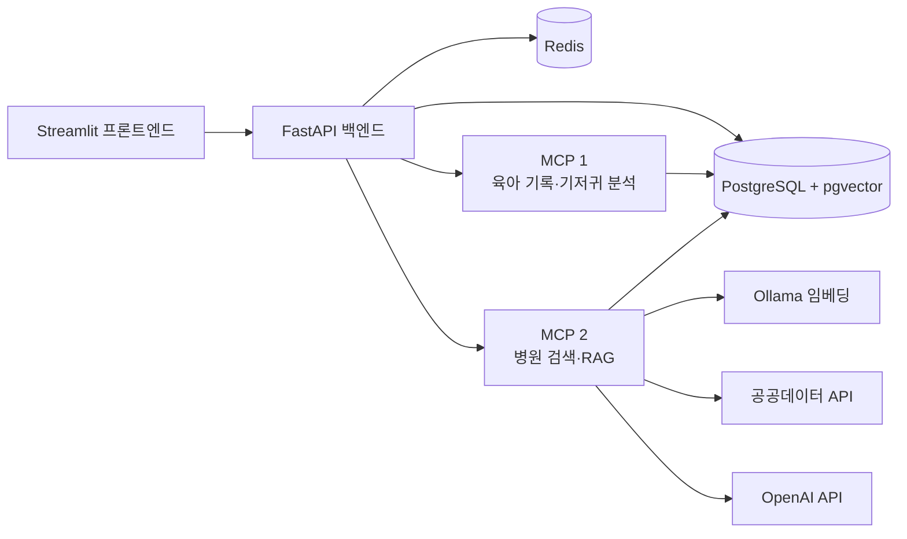

# 베베온 (AI Baby Care Assistant)

0~36개월 영유아 보호자를 위한 AI 기반 맞춤형 육아 지원 서비스입니다.

단순히 기록을 저장하고 분석해 보여주는 것에서 나아가, AI가 아이의 생활 패턴을 파악해 수유나 수면 등 필요한 시점을 먼저 알려주고, 실제 육아 행동과 기록까지 자연스럽게 연결​합니다.

또한 육아 기록, 생활 패턴 조회, RAG 기반 육아 정보, 기저귀 이미지 분석, 병원 검색 등의 기능을 하나의 Single Agent로 연결하여 사용자의 요청에 따라 필요한 기능을 판단하고 실행하도록 구현했습니다.

## 팀 프로젝트 개요 

- 팀명: 응애이전트
- 팀원 및 역할: 총 4명
    1. 정예진 : 팀장 / 프론트엔드: Streamlit 화면 설계·구현, 반응형 UI, FastAPI 연동
    2. 신유빈 : 백엔드: FastAPI API, DB·Redis 연동, 인증·기록·알림 기능 구현
    3. 한다영 : MCP 서버 1: 육아 기록·생활 패턴·성장 분석 관련 MCP 서버 구현
    4. 한태경 : MCP 서버 2: 병원 정보·육아 정보 검색·RAG 관련 MCP 서버 구현
- 프로젝트 기간: 2026년 9월 8일 ~ 9월 10일
- 저장소·협업 링크:
    - GitHub 저장소: https://github.com/jyeyeyej/team3_AI_Baby_Care_Assistant.git
    - 협업 문서 또는 Notion: https://app.notion.com/p/3-9-3d4a62ceb52180fab2fdc9fe1fc7ef99?pvs=28
- 사용한 외부 API 및 도구:
    - OpenAI API: AI 육아 상담, 음성 STT, 기저귀 사진 분석
    - 공공데이터포털 API: 전국 병·의원 및 응급의료기관 정보 검색
    - Streamlit (약간의 html/css): 사용자 화면 구현
    - FastAPI: 백엔드 API 구현
    - PostgreSQL / Redis: 아기 정보·육아 기록·알림·메모리 데이터 관리
    - MCP: AI 기능과 육아 기록·병원 정보 도구 연동
    - Ollama: 육아 정보 문서 검색용 임베딩 모델
- 운영 매니저 확인사항:
    - 테스트 사용자로 로그인 (JWT 구현 안함)
    - 예방접종 데이터는 개인정보 때문에 mook데이터로 구현
- 추가 산출물:
    - 시연 영상

## 주요 기능

### 육아 기록 관리

- 수유, 수면, 배변, 성장 기록 조회 및 수정
- 최근 7일 육아 기록과 수유 간격·성장 추이 확인
- 육아 기록을 바탕으로 한 AI 분석 요약
- 홈 화면 및 AI 도우미에서 빠른 기록 화면으로 이동

### AI 육아 도우미

- 자연어 대화를 통한 육아 질문 응답
- 월령별 수유, 이유식, 수면, 발달 등 육아 지식 안내
- 아기 정보와 최근 육아 기록을 반영한 맞춤 답변
- RAG 검색 결과를 바탕으로 근거 중심의 답변 제공
- 지역명을 입력해 주변 소아과 및 응급실 검색

### 음성·이미지 기반 기록

- 마이크를 통한 음성 입력 및 STT 변환
- 음성 인식 결과를 채팅창에서 먼저 확인
- 내용 확인 및 승인 시에만 기록 저장
- 기저귀 사진 업로드 또는 카메라 촬영 후 AI 관찰 결과 안내
- 사진만으로 질환을 단정하지 않고, 필요한 경우 전문가 상담을 안내

### 아기 정보와 알림

- 아기 기본 정보, 성장 정보, 알레르기 정보 관리
- 보호자 정보 및 알림 설정 관리
- 수유 알림 확인, 다시 알림, 건너뛰기 기능
- 예방접종 일정과 접종 내역 확인

## 화면 구성

- 로그인 화면: 테스트 사용자 선택 및 서비스 소개
- 홈: 최근 육아 기록, 다음 예방접종, 성장·수유 그래프, AI 도우미 바로가기
- AI 육아 도우미: 채팅, 음성 입력, 사진 분석, RAG·병원 검색
- 육아 관리: 육아 기록, 생활 패턴, 성장, 예방접종 탭
- 내 정보: 아기 정보, 보호자 정보, 알림 설정 탭

## 시스템 구성

```text
Streamlit Frontend
        │
        ▼
FastAPI Backend
        │
        ├─ 육아 기록·아기 정보·알림 관리 API
        ├─ AI Agent Runtime
        ├─ STT 승인 상태 관리
        │
        ├──────────────► Database
        │                 └─ 아기 정보, 육아 기록, 알림 설정,
        │                    사용자/승인 이력, RAG 문서 메타데이터
        │
        ├──────────────► Redis
        │                 └─ 세션·캐시, STT 승인 임시 상태,
        │                    작업 큐/알림 스케줄 상태
        ▼
MCP Servers
        ├─ baby_care_server ───► Database / Redis
        └─ baby_info_server ───► Vector DB 또는 Database
                                  └─ 육아 지식 RAG 임베딩
```

## 기술 스택

| 구분 | 기술 |
| --- | --- |
| Frontend | Streamlit, 약간의 HTML/CSS |
| Backend | Python, FastAPI |
| AI Agent | OpenAI Responses API |
| MCP | Streamable HTTP |
| RAG | Ollama Embedding, PostgreSQL pgvector |
| 데이터베이스 | PostgreSQL, Redis |
| 음성 입력 | STT |
| 외부 데이터 | 병·의원 공공데이터 API |

## 프로젝트 구조

```text
frontend/                 # Streamlit 화면 및 API 연결
backend/                  # FastAPI 서버
mcp_servers/
  baby_care_server/       # 육아 기록·패턴·알림 MCP 도구
  baby_info_server/       # RAG·병원 검색 MCP 도구
documents/                # 기획서, API 계약서, 아키텍처 문서
```

## 시스템 아키텍처


## 실행 방법

### 1. 프론트엔드 실행

```bash
streamlit run frontend/app.py
```

### 2. 환경 변수 설정

`.env` 파일에 백엔드 및 MCP 서버 주소, API 키 등 실행 환경에 필요한 값을 설정합니다.

```env
프론트엔드 PC
  └─ Streamlit
       ├─ http://192.168.1.12:8000  → Backend + DB + Redis PC
       ├─ http://192.168.0.25:8101  → baby_care MCP PC
       └─ http://192.168.0.26:8102  → baby_info MCP PC
```
Test-NetConnection 192.168.1.12 -port 8000 성공
Test-NetConnection 192.168.1.25 -Port 8101 성공
Test-NetConnection 192.168.1.26 -Port 8102 성공 

`USE_MOCK_API=true`에서는 준비된 테스트 데이터로 화면을 시연할 수 있습니다.
백엔드가 연결된 환경에서는 `false`로 변경하여 실제 API를 호출합니다.

## 데이터 처리 원칙

- 텍스트·버튼으로 입력한 육아 기록은 유효성 검증 후 저장합니다.
- 음성(STT)으로 인식된 실제 육아 기록은 보호자가 내용을 확인하고 승인한 경우에 저장합니다.
- 소아과, 응급실 검색은 사용자가 입력한 지역명을 기준으로 수행합니다.
- RAG 검색 결과가 부족할 때는 추측으로 정보를 만들지 않고, 정보 부족을 안내합니다.
- 기저귀 사진 분석은 관찰 가능한 특징을 안내하며 의료 진단을 대신하지 않습니다.
- 아기·보호자 정보와 음성/사진 데이터는 최소한으로 수집합니다.
- 사용자는 자신의 육아 기록과 업로드한 사진·음성 데이터를 조회·수정·삭제할 수 있습니다.
- 모든 기록은 입력 시각, 수정 시각, 입력 방식(텍스트·버튼·음성)을 함께 관리합니다.
- 동일 요청이 반복되어도 기록이나 알림이 중복 생성되지 않도록 처리합니다.
- 병원 정보는 검색 시점의 외부 데이터에 따라 달라질 수 있음을 안내하고, 가능하면 출처와 조회 시각을 제공합니다.
- 알림은 사용자가 설정한 시간대와 권한을 기준으로 발송하며, 실패 시 재시도 또는 실패 상태를 기록합니다.
- 접근 권한을 확인하여 보호자는 본인과 연결된 아기 정보만 조회·수정할 수 있도록 합니다.

## 제출 문서 
### 진행가이드 기반 산출물 제출 문서 2가지 
- [산출물 1｜에이전트 아키텍처 설계서](documents/deliverable_1_agent_architecture.md)
- [산출물 2｜에이전트 시험 결과 보고서](documents/deliverable_2_agent_test_report.md)

### 강사님 요청 제출 문서 2가지 
- [ai 에이전트 계획서](documents/agent-architecture-design.md)
- [상세 ai 에이전트 테스트 완료보고서](documents/ai_agent_test_completion_report.md)

## 기획 문서

- [전체 기획서](documents/overall_plan.md)
- [프론트엔드 기획서](documents/frontend_plan.md)
- [백엔드 계획서](documents/backend_plan.md)
- [API 계약서](documents/frontend_api_contract.md)
- [육아 기록·패턴 MCP 서버 계획서](documents/baby_care_server_plan.md)
- [육아 정보 RAG·병원 검색 MCP 서버 계획서](documents/baby%20info%20server_plan.md)
