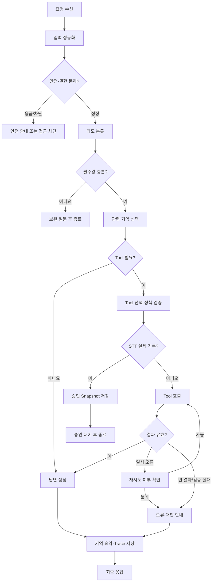
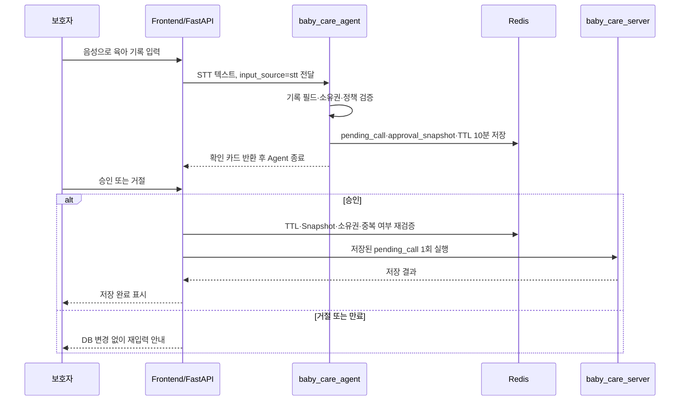

# 산출물 1｜에이전트 아키텍처 설계서

> 서비스명: **AI Baby Care Assistant**  
> 대상: 0~36개월 영유아 보호자를 위한 AI 육아 도우미  

## 팀 프로젝트 개요 

- 팀명: 응애이전트
- 팀원 및 역할: 총 4명
    1. 정예진 : 팀장 / 프론트엔드: Streamlit 화면 설계·구현, 반응형 UI, FastAPI 연동
    2. 신유빈 : 백엔드: FastAPI API, DB·Redis 연동, 인증·기록·알림 기능 구현
    3. 한다영 : MCP 서버 1: 육아 기록·생활 패턴·성장 분석 관련 MCP 서버 구현
    4. 한태경 : MCP 서버 2: 병원 정보·육아 정보 검색·RAG 관련 MCP 서버 구현
- 프로젝트 기간: 2026년 9월 8일 ~ 9월 10일
- 저장소·협업 링크:
    - GitHub 저장소: https://github.com/jyeyeyej/team3_AI_Baby_Care_Assistant.git
    - 협업 문서 또는 Notion: https://app.notion.com/p/3-9-3d4a62ceb52180fab2fdc9fe1fc7ef99?pvs=28
- 사용한 외부 API 및 도구:
    - OpenAI API: AI 육아 상담, 음성 STT, 기저귀 사진 분석
    - 공공데이터포털 API: 전국 병·의원 및 응급의료기관 정보 검색
    - Streamlit (약간의 html/css): 사용자 화면 구현
    - FastAPI: 백엔드 API 구현
    - PostgreSQL / Redis: 아기 정보·육아 기록·알림·메모리 데이터 관리
    - MCP: AI 기능과 육아 기록·병원 정보 도구 연동
    - Ollama: 육아 정보 문서 검색용 임베딩 모델
- 운영 매니저 확인사항:
    - 테스트 사용자로 로그인 (JWT 구현 안함)
    - 개인정보 때문에 예방접종 데이터는 mook데이터로 구현
- 추가 산출물:
    - 시연 영상

## 1. 서비스 개요

> 구현 정합성 안내: 현재 MVP는 Backend의 정책 기반 `AgentLoop`으로 계획 → 허용 Tool 실행 → 결과 검증을 처리하고, 입력·권한·승인·기록 저장은 Backend 정책이 통제한다. Reflection은 필수값 누락 보완 질문, 병원 검색 1회 재시도·안전 종료, RAG 근거 부족 안전 폴백을 수행한다. OpenAI 모델은 의도 분류와 일반 육아 안내 생성에 사용한다. StateGraph의 모든 노드가 독립 Runtime 노드로 분리되거나 모델이 자유롭게 반복 Function Calling을 수행한다는 의미는 아니다.

- **서비스명:** AI Baby Care Assistant
- **목적:** 수유·수면·배변·성장 기록과 보호자의 질문을 바탕으로, 아기 월령·수유 방식·알레르기를 반영한 육아 정보를 제공한다.
- **주요 사용자:** 0~36개월 영유아의 보호자
- **연계 도구:** `baby_care_server` MCP, `baby_info_server` MCP, FastAPI, Redis, PostgreSQL. RAG 최종 답변 생성에는 OpenAI Responses API를 사용한다.
- **Agent 구조:** 현재 MVP는 FastAPI의 정책 기반 `AgentLoop`과 OpenAI Chat Completions 기반 의도 분류·일반 안내를 결합한다. `AgentLoop`은 계획 → 허용된 MCP Tool 실행 → 결과 검증을 수행한다. 아래 StateGraph와 모델 주도 단일 Agent Loop는 이를 확장하는 목표 아키텍처이며, 허용된 MCP Tool 선택·결과 검증 기준을 정의한다.

| 처리 주체 | 담당 기능 |
| --- | --- |
| Agent + MCP | 육아 기록 저장·조회, 생활 패턴, 기저귀 사진 관찰, 육아 지식 RAG, 소아과·응급실 검색 |
| Frontend + FastAPI 일반 API | 알림 확인·10분 후·건너뛰기, 아기 정보·알레르기 수정, 저장 기록 수정·삭제 |

화면 버튼으로 즉시 처리할 수 있는 수정·삭제·알림 변경은 Agent를 거치지 않는다.

## 2. StateGraph 노드 설계

StateGraph는 **인지 → 판단 → 행동 → 검증** 순서로 요청을 처리한다.

| 단계 | 노드 | 역할 | 주요 입력 | 주요 출력 |
| --- | --- | --- | --- | --- |
| 인지 | `Receive Request` | 요청·세션을 수신하고 실행 State를 생성 | 메시지, 파일, `user_id`, `baby_id` | `request_id`, State |
| 인지 | `Normalize Input` | 텍스트·UI·STT·이미지 입력을 정규화 | 원본 요청, 입력 출처 | `question`, `input_source` |
| 인지 | `Safety Screen` | 응급 위험·진단 요구·권한 문제를 선별 | 정규화 요청 | `safety_level`, 안전 응답 |
| 판단 | `Intent Parser` | 기록·조회·사진·지식·병원 검색 의도 분류 | 질문, 최근 메시지 | `intent`, 엔터티 |
| 판단 | `Validate Input` | Tool 실행에 필요한 데이터·소유권 검증 | intent, 엔터티, 아기 정보 | 검증 결과, `missing_fields` |
| 판단 | `Memory Selector` | 요청에 관련된 기억만 선택 | intent, 프로필, 최근 대화 | `selected_context` |
| 판단 | `Tool Selector` | 필요한 Tool과 검증할 인수 선택 | 검증된 요청, 허용 목록 | `tool_plan` |
| 행동 | `Human Confirm` | STT로 추출한 실제 기록의 승인 대기 | STT 기록, Tool 호출안 | 승인 Snapshot 또는 거절 |
| 행동 | `Tool Execute` | 검증된 MCP Tool 호출 | Tool명, arguments | `tool_results` |
| 검증 | `Verify Result` | 결과 스키마·빈 결과·오류·중복 여부 검증 | Tool 결과 | 다음 노드 결정 |
| 검증 | `Answer Composer` | 근거·주의사항을 포함한 답변 생성 | 결과, 선택 컨텍스트 | `final_answer` |
| 검증 | `Memory Summary` | 필요한 사실만 요약·Trace 저장 | 최근 대화, 실행 결과 | 요약·Trace |
| 종료 | `Finish` | 종료 상태와 응답 반환 | status, answer | 최종 API 응답 |

## 3. 상태 흐름도

### STT 기록 승인 시퀀스

## 4. 주요 분기 조건과 예외 폴백

| 조건 | 처리 | 폴백 또는 종료 |
| --- | --- | --- |
| 일반 인사·화면 안내 | Tool 없이 답변 생성 | `model_finished` |
| 기록 종류·시각·필수값 누락 | Tool 호출 금지 | 누락한 값만 보완 질문 |
| 텍스트·UI로 입력한 기록 | `record_care_event` 실행 | 검증 후 즉시 저장 |
| STT 실제 육아 기록 | Redis 승인 State 생성 | 승인 전 DB 변경 없이 `waiting_stt_approval` 종료 |
| “먹이려 했지만 안 먹었어” | 실제 기록이 아니므로 저장 Tool 미호출 | 승인 Snapshot·알림 재계산 없음 |
| 병원 검색에 지역 없음 | 병원 Tool 미호출 | 지역 입력 요청 |
| 병원·RAG 결과 없음 | 빈 결과 또는 근거 부족을 사실대로 반환 | 검색 범위 변경·추가 질문 안내 |
| 이미지 형식·크기·품질 오류 | 사진 분석 Tool 미호출 | 재촬영/재업로드 요청 |
| 응급 위험 표현 | 검색·기록보다 안전 안내를 우선 | 즉시 진료·응급 도움 요청 안내 |
| 타 사용자의 `baby_id` | Tool 실행 차단 | 정보 미노출·접근 오류 |
| MCP 연결 실패 | 일시 오류만 1회 재시도 | 실패 사실과 재시도 안내 |
| 같은 승인 요청 반복 | `idempotency_key` 검사 | 기존 결과 반환, 중복 저장 방지 |

## 5. Function Calling · Tool Use 흐름

1. Runtime이 두 MCP 서버의 `tools/list`를 조회한다.
2. 발견된 Tool과 `BABY_CARE_AGENT.allowed_tools`의 교집합만 모델에 제공한다.
3. 모델이 Function Call을 제안하면 Runtime이 Tool명, arguments, 사용자·아기 소유권, Allowlist, `ACTION_POLICY`를 검증한다.
4. 조회·검색 Tool은 바로 호출한다. 기록 Tool은 텍스트·UI이면 즉시 실행하고 STT이면 `Human Confirm` 노드로 이동한다.
5. `Verify Result`가 결과 스키마·빈 결과·오류 코드·중복 여부를 검증한다.
6. 유효한 결과는 `Answer Composer`로 전달한다. 일시 오류는 제한적으로 재시도하고, 그 외 오류는 대안 안내로 종료한다.
7. Function Call이 없으면 Tool 없이 답변을 생성한다.

| 도구 | 입력 | 출력 | 실패 처리 |
| --- | --- | --- | --- |
| `record_care_event` | 아기, 이벤트 종류, 시각, 상세값, 멱등 키 | 기록 ID, 저장 시각, 다음 알림 | 필수값·범위·중복·STT 미승인 오류 반환 |
| `get_care_records` | 아기, 조회 유형, 기간 | 기록 목록 또는 패턴, `sufficient_data` | 기록 없음은 정상 빈 결과 |
| `analyze_infant_stool` | 아기, 임시 이미지, 월령, 수유 방식 | 관찰·주의 신호·출처·안전 안내 | 형식·품질 오류는 재촬영 안내, 진단 금지 |
| `search_pediatric_hospitals` | 지역, 페이지, 개수 | 소아과 목록·확인 시점 | 지역 누락 보완 질문, 결과 없음은 빈 목록 |
| `search_emergency_hospitals` | 지역, 페이지, 개수 | 응급실 목록·확인 시점 | 지역 누락 보완 질문, 결과 없음은 빈 목록 |
| `search_feeding_guide` 등 RAG Tool | 질문, 월령, `top_k` | 수유·수면·이유식·발달·안전 근거 | 근거 부족 시 추측하지 않음 |

| 실행 종류 | 위험도 | 승인 정책 |
| --- | --- | --- |
| 기록 조회·패턴·병원 검색·RAG·사진 관찰 | low | 별도 승인 없이 실행 |
| 육아 기록 저장 | medium | 텍스트·UI는 검증 후 즉시 실행, STT는 승인 후 1회 실행 |
| 진단·처방·타 사용자 정보 접근 | forbidden | 승인 여부와 관계없이 차단 |

## 6. 공유 상태 객체

| 필드명 | 타입 | 예시 | 사용 노드 | 설명 |
| --- | --- | --- | --- | --- |
| `messages` | `list[dict]` | 최근 대화 | Intent Parser, Memory Selector | 현재 대화 맥락 |
| `user_id` | `str` | `user-001` | Validate, Tool Execute | 보호자·권한 식별 |
| `baby_id` | `str` | `baby-001` | Validate, Memory, Tool | 기록 대상 아기 식별 |
| `session_id` | `str` | `session-001` | Memory Summary, Trace | 현재 대화 식별 |
| `request_id` | `str` | `req-001` | 전체 | 요청 추적 |
| `question` | `str` | `분유 100ml 먹었어` | Intent Parser, Answer Composer | 정규화된 요청 |
| `input_source` | `Literal['text','ui','stt','image']` | `stt` | Human Confirm, Tool Execute | 입력 경로별 승인 판단 |
| `intent` | `str \| None` | `record_care_event` | Tool Selector | 요청 의도 |
| `entities` | `dict` | 수유량·지역·기간 | Validate Input | 요청에서 추출한 값 |
| `missing_fields` | `list[str]` | `["region"]` | Answer Composer | 보완 질문 대상 |
| `safety_level` | `Literal['normal','caution','emergency','blocked']` | `normal` | 전체 | 안전 분기 수준 |
| `selected_context` | `dict` | 월령·수유 방식·알레르기 | Tool Selector, Answer Composer | 현재 요청에 필요한 기억 |
| `tool_plan` | `list[dict]` | Tool명·검증된 인수 | Tool Execute | 실행 예정 Tool |
| `tools_called` | `list[str]` | `["get_care_records"]` | Verify Result, Trace | 호출 Tool 이력 |
| `tool_results` | `list[dict]` | 결과·오류 코드 | Verify Result | Tool 실행 결과 |
| `error_count` | `int` | `1` | 재시도 판단 | 오류·재시도 횟수 |
| `iteration` | `int` | `2` | 종료 판단 | 그래프 반복 횟수 |
| `pending_call` | `dict \| None` | 승인 대기 호출 | 승인 API | STT 승인 후 1회 실행할 호출 |
| `idempotency_key` | `str \| None` | `session-001-tool-001` | Tool Execute | 중복 DB 변경 방지 |
| `status` | `str` | `completed` | Finish | 실행 상태 |
| `termination_reason` | `str \| None` | `model_finished` | Finish | 종료 이유 |
| `final_answer` | `str \| None` | 사용자 안내 문장 | Finish | 최종 응답 |

### STT 승인 전용 State

| 필드 | 타입 | 설명 |
| --- | --- | --- |
| `tool_call_id` | `str` | 승인할 Tool 호출 식별자 |
| `pending_call` | `dict` | 실행 전 Tool 이름과 arguments |
| `approval_snapshot` | `dict` | 보호자에게 보여 준 기록 내용 |
| `idempotency_key` | `str` | 승인 중복 실행 방지 키 |
| `expires_at` | `datetime` | 승인 만료 시각(10분) |
| `status` | `Literal['waiting_stt_approval']` | 승인 대기 상태 |

## 7. 기억 및 컨텍스트 관리

### 단기 기억

- Redis `chat:{user_id}:{session_id}`에 최근 사용자·AI 메시지 **최대 8개**를 저장한다.
- 현재 질문, 보완 질문 상태, 방금 확정한 기록, 승인 대기 상태를 유지한다.
- 세션 키는 1일 Sliding TTL을 적용한다.

### 장기 기억

- 현재 MVP는 PostgreSQL `user_memories`에 답변 스타일·길이·단위처럼 안전한 사용자 선호만 저장한다.
- 아기 월령·수유 방식·알레르기·정확한 육아 기록은 각각 `babies`, `care_logs`를 기준 데이터로 사용한다. 대화 요약 자동 저장은 확장 목표다.
- 저장 금지: 전체 대화 원문, 모델의 숨겨진 추론, 음성·기저귀 사진 원본, API Key·접속정보.

### 컨텍스트 윈도우 및 요약 전략

- `Memory Selector`가 현재 의도에 필요한 월령·수유 방식·알레르기·최근 기록만 선택한다.
- 최근 메시지는 최대 8개만 모델에 제공하며 TTL 만료 시 원문은 삭제한다. 오래된 대화의 `conversation_summary` 자동 저장은 확장 목표다.
- Tool 결과 전문은 보관하지 않고 결과 요약·출처·오류 코드·확인 시점만 남긴다.
- 관련 없는 기억과 민감한 원문은 모델 컨텍스트에서 제외한다.

## 8. 상태 중복 제거 기준과 그래프 종료 조건

### 상태 중복 제거 기준

- 보호자·아기·세션·요청 식별은 `user_id`, `baby_id`, `session_id`, `request_id` 하나씩만 사용한다.
- 최근 원문 대화와 장기 요약을 동시에 전부 전달하지 않고, 현재 요청에 필요한 범위만 선택한다.
- Tool 결과 전체를 `messages`, `tool_results`, `trace`에 반복 저장하지 않는다. 결과는 구조화 값, Trace는 사건 요약만 저장한다.
- STT 승인 후에는 화면이 다시 보낸 인수 대신 Redis `pending_call`을 실행한다.
- `idempotency_key`로 동일 Tool 호출의 DB 변경을 한 번만 허용한다.

### 그래프 종료 조건

| 종료 상황 | `status` | `termination_reason` |
| --- | --- | --- |
| Function Call 없이 최종 답변 생성 | `completed` | `model_finished` |
| 필수 데이터 부족으로 보완 질문 반환 | `completed` | `clarification_required` |
| STT 기록 승인 대기 | `waiting_stt_approval` | `stt_approval_required` |
| 사용자가 승인 거절 | `rejected` | `user_rejected` |
| Tool·정책·소유권 검증 실패 | `failed` | `invalid_tool_call` 등 오류 코드 |
| OpenAI 또는 MCP 오류 | `failed` | `model_error` 또는 `mcp_tool_error` |
| 최대 Agent 단계 초과 | `stopped` | `max_steps_exceeded` |

## 9. 검증 시나리오 및 완료 기준

| 시나리오 | 기대 결과 |
| --- | --- |
| 텍스트로 “분유 100ml 먹었어” 입력 | 검증 후 기록이 한 번 저장되고 다음 알림 결과 반환 |
| STT로 수유 기록 입력 | 승인 카드만 반환하며 승인 전 DB 변경 없음 |
| 승인 버튼을 두 번 클릭 | 멱등 키로 1회만 저장되고 기존 결과 반환 |
| 지역 없이 “근처 소아과 알려줘” 요청 | Tool 호출 전 지역 입력 요청 |
| RAG 검색 결과 없음 | 출처를 꾸며내지 않고 근거 부족 안내 |
| 지원하지 않는 이미지 파일 | 분석 Tool 실행 전 차단하고 재업로드 안내 |
| 응급 위험 표현 | 진단 대신 즉시 진료·응급 도움 안내를 우선 |

다음 조건을 만족하면 설계를 완료로 판단한다.

- 모든 요청이 인지 → 판단 → 행동 → 검증을 거쳐 명확한 종료 상태에 도달한다.
- Function Calling은 Allowlist·소유권·입력값·정책 검증 후에만 실행된다.
- 텍스트·UI 기록은 검증 후 저장되고, STT 기록은 승인 후 정확히 한 번만 저장된다.
- 단기 기억은 TTL로 만료되고, 현재 장기 기억에는 안전한 답변 선호 정보만 남는다.
- Tool 실패·빈 결과·권한 오류·최대 단계 초과는 안전한 폴백 응답으로 처리된다.
