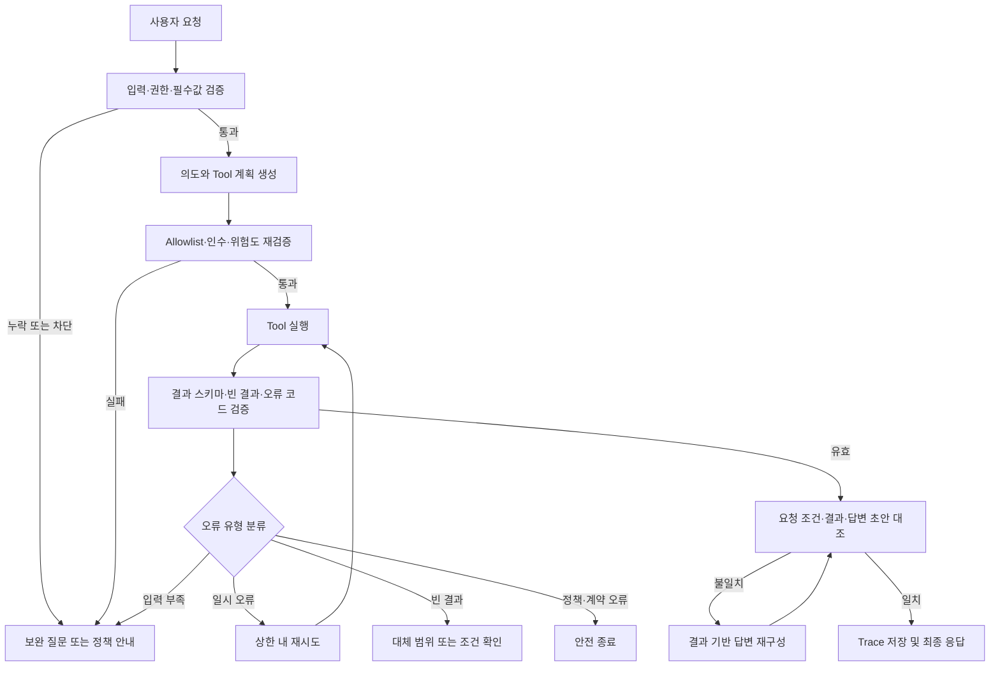

# 산출물 2｜에이전트 시험 결과 보고서

> 서비스명: **AI Baby Care Assistant**  
> 대상: 0~36개월 영유아 보호자를 위한 AI 육아 도우미  
> 시험 대상: `baby_care_agent`, `baby_care_server`, `baby_info_server` 및 FastAPI 연동 경로  


## 1. 시험 목적

본 시험은 동일한 요청 데이터에서 **기준선 처리(Baseline)** 와 **자기 성찰(Reflection) 검증 루프 적용 처리**를 비교한다. 비교 지표는 태스크 완료율, 도구 선택 정확도, 응답 일관성, 평균 재시행 횟수이다.

자기 성찰 루프는 모델의 숨겨진 추론을 저장하거나 노출하는 기능이 아니다. Tool 실행 전후의 구조화된 입력·출력, 정책, 사용자 요청 조건을 다시 대조하여 오류를 감지하고 안전한 다음 행동을 선택하는 실행 검증 절차이다.

### 1.1 시험 범위

- 육아 기록 저장·조회와 생활 패턴 조회
- 월령별 육아 RAG 검색
- 소아과·응급실 검색
- 일반 육아 안내의 안전 제약
- STT 승인 기록의 중복 실행 방지
- Tool 결과 스키마·카테고리·최종 응답의 정합성

### 1.2 비교 조건

| 구분 | Baseline | Reflection 적용 |
| --- | --- | --- |
| 입력 검증 | 요청별 결정론적 검증 | 동일 검증 + 누락 원인 구조화 기록 |
| Tool 실행 전 | 라우팅·Allowlist·필수값 확인 | Tool 계획과 정책·필수 인수의 재대조 |
| Tool 실행 후 | MCP 응답 성공 여부 및 일부 스키마 검증 | 스키마·빈 결과·오류 코드·요청 조건·답변 초안 대조 |
| 실패 처리 | 구현된 폴백 또는 예외 종료 | 오류 분류 후 재시도·보완 질문·대체 전략·안전 종료 선택 |
| 최종 응답 | 각 라우팅 함수가 구성 | 검증 통과한 결과만 근거로 재구성 |

## 2. 시험 환경 및 데이터 구성

### 2.1 환경

| 항목 | 내용 |
| --- | --- |
| Agent Runtime | Python 기반 FastAPI Agent Service |
| 모델 사용 지점 | 의도 분류, 일반 육아 안내 생성 |
| 데이터 저장 | PostgreSQL, Redis |
| Tool 연동 | `baby_care_server`, `baby_info_server` MCP |
| 외부 연동 | 병·의원·응급의료기관 공공데이터 API |
| 시험 방식 | 단위 시험 + MCP 응답 모의(Mock) + 통합 시험 Trace 비교 |

### 2.2 시험 데이터셋

산출물 1의 정상(`N`)·예외(`E`) 시나리오를 재사용하고, 자기 성찰 검증을 위해 결과 불일치·반복 호출 케이스를 추가한다. 아래 건수는 권장 최소 구성이다. 실제 비교 시 각 케이스의 동일한 입력, 사용자·아기 컨텍스트, Mock 결과를 두 조건에 공통 적용한다.

| 유형 | 권장 건수 | 대표 확인 항목 |
| --- | ---: | --- |
| 정상 조회·추천·생성 | 20 | 기대 Tool 선택, 완료 상태, 응답 근거 |
| 필수 파라미터 누락 | 10 | Tool 호출 전 보완 질문 여부 |
| 도구 선택 오류 유발 | 10 | 기대 Tool 외 호출 차단 여부 |
| Tool 결과 스키마·카테고리 오류 | 10 | 결과 폐기 및 안전 종료 여부 |
| 빈 결과·근거 부족 | 10 | 사실 기반 빈 결과·대체 범위 안내 |
| API/MCP 타임아웃·연결 실패 | 10 | 재시도 상한 및 종료 정책 |
| 권한·STT 승인·중복 요청 | 10 | 정보 차단, 승인·멱등성 검증 |
| 최종 응답 불일치 유발 | 10 | Tool 결과와 답변 재대조 여부 |
| **합계** | **90** | 동일 데이터셋으로 전후 비교 |

### 2.3 Baseline 자동 시험 실행 결과

2026-09-09에 현재 구현을 Baseline으로 하여 `backend/tests`, `mcp_servers/baby_care_server/tests`, `mcp_servers/baby_info_server/tests`를 실행했다.

| 항목 | 실측 결과 | 비고 |
| --- | ---: | --- |
| 전체 수집 테스트 | 130개 | 자동 테스트 기준 |
| 통과 | 88개 | 실패 0개 |
| 건너뜀 | 42개 | PostgreSQL 연동 39개, Stool RAG DB 연동 3개 |
| 실행된 테스트 통과율 | 100% | 88 ÷ 88 |
| 실행 시간 | 3.30초 | `pytest -q -rs` 기준 |

건너뜀은 기능 실패가 아니라 `RUN_DB_TESTS=1` 또는 `RUN_RAG_DB_TESTS=1`이 설정된 DB 통합 환경에서만 실행하도록 구성된 테스트다. 따라서 이 결과는 **현재 자동화된 단위·Mock 시험의 Baseline 통과 결과**이며, DB·외부 연동을 포함한 전체 통합 시험 완료를 의미하지 않는다.

### 2.4 Live API Trace 탐색 결과

실행 중인 Backend의 채팅 API에 테스트 사용자로 요청을 보내고 Redis Trace를 조회했다. 일반 육아 안내, 병원 검색, 수유 RAG 검색 요청은 모두 성공 응답을 반환했고, 수유 RAG 요청은 출처 5건과 high 신뢰도를 반환했다.

초기 Trace는 Tool 사용을 knowledge_search로 고정 기록했으나, 재시험 전 실제 Tool명·안전한 인수 요약·결과 검증 상태를 저장하도록 보강했다. 최신 Trace에서는 일반 육아 안내는 Tool 미호출, 병원 검색은 search_pediatric_hospitals, 수유 RAG는 search_feeding_guide로 기록됐다. 이는 Live 파일럿 3건의 증빙 범위이며, 텍스트 기록 경로의 상세 Tool 인수, 다단계 Tool 실행 순서와 모든 오류의 재시도 Event는 후속 통합 시험에서 확대 수집한다.

## 3. 오류 감지 기준

| 오류 유형 | 감지 기준 | 판정 예시 |
| --- | --- | --- |
| 할루시네이션 | Tool 결과·RAG 출처·등록 프로필에 없는 사실을 확정적으로 답변에 포함 | 검색 결과에 없는 병원명·주소를 제시하거나, 저장되지 않은 수유 기록을 안내 |
| 도구 선택 오류 | 요청 의도와 기대 Tool이 다르거나, Tool 없이 처리해야 할 요청에 Tool을 호출 | 지역 없는 병원 검색에 검색 Tool 호출, 조회 요청에 기록 저장 Tool 호출 |
| 파라미터 누락 | Tool 계약의 필수 인수 또는 값 범위가 충족되지 않음 | 수유량 없는 수유 저장, 지역 없는 병원 검색, 잘못된 `event_type` |
| 정책·권한 오류 | Allowlist, 소유권, STT 승인, 금지 행위 정책 위반 | 타 사용자 `baby_id`, 승인 전 STT 저장, 진단·처방 요청 |
| 결과 스키마 오류 | 성공 응답의 필수 필드·타입·요청 카테고리·출처가 계약과 다름 | `feeding` 검색에 `sleep` 카테고리 결과 반환 |
| 빈 결과 처리 오류 | 빈 목록·근거 부족을 실패 또는 허위 성공으로 안내 | 병원이 없는데 목록을 생성하거나 RAG 출처를 꾸며 냄 |
| 응답 불일치 | 최종 답변의 기록값·시각·병원 정보·출처가 Tool 결과와 다름 | 저장 결과는 100ml인데 답변이 120ml라고 안내 |
| 반복 초과 | 같은 목적의 호출을 이유 없이 상한 이상 반복 | 일시 오류 외 동일 Tool을 3회 이상 호출, 멱등 키 없이 저장 재호출 |

## 4. 자기 성찰 루프

> 적용 범위: 현재 MVP의 정책 기반 `AgentLoop`은 계획 → Allowlist Tool 실행 → 결과 기본 검증을 수행하고 상세 Trace를 남긴다. 현재 구현된 Reflection은 필수값 누락의 보완 질문, 병원 검색 Tool의 1회 재시도·안전 종료, RAG 근거 부족의 안전 폴백이다. 자동 원인 분석, 응답 불일치 재구성, 모든 오류 유형의 재계획·재실행은 확장 Reflection 설계이며 후속 통합 시험 범위다.



### 4.1 단계별 검증 항목

1. **입력 검증**: 세션, `user_id`, `baby_id`, 입력 출처, 필수 필드, 값 범위를 확인한다.
2. **Tool 계획 검증**: 선택 Tool이 허용 목록에 있고 요청 의도·위험도·승인 정책과 맞는지 확인한다.
3. **결과 검증**: 성공 여부, 스키마, RAG 카테고리, 출처, 빈 결과, 오류 코드를 확인한다.
4. **오류 분류**: 일시 오류, 입력 부족, 정책 위반, 계약 오류, 빈 결과, 응답 불일치로 분류한다.
5. **전략 선택**: 재시도, 보완 질문, 검색 범위 조정, 결과 기반 답변 재구성, 안전 종료 중 하나만 선택한다.
6. **최종 대조**: 사용자 요청의 조건, Tool 결과, 답변의 수치·고유값·출처가 모두 일치하는지 확인한다.

## 5. 오류 유형별 재시도 및 대체 전략

| 오류 유형 | 최대 재시도 | 수정·대체 전략 | 종료 조건 |
| --- | ---: | --- | --- |
| 필수 파라미터 누락 | 0회 | Tool 호출을 중지하고 누락 값만 질문 | 필수값 확보 또는 사용자 취소 |
| 입력 범위·형식 오류 | 0회 | 유효 범위와 입력 예시 제시 | 수정된 입력 수신 또는 종료 |
| 병원 API 타임아웃 | 추가 1회 | 동일 요청을 제한적으로 재시도 후 지연 안내 | 성공 또는 1회 재시도 실패 |
| MCP 연결 실패 | 추가 1회 | 연결 상태 확인 후 1회 재시도 | 성공 또는 실패 사실·대체 경로 안내 |
| 호출 한도 초과 | 0회 | 재실행 가능 시점·대기 안내 | 사용자가 이후 다시 요청 |
| RAG/병원 빈 결과 | 0회 | 빈 결과를 사실대로 안내하고 지역·월령·질문 범위 보완 제안 | 조건 보완 또는 종료 |
| 결과 스키마·카테고리 불일치 | 0회 | 결과 폐기, 계약 오류 Trace 기록, 사용자에게 근거 부족 안내 | 유효 결과 재확보 또는 안전 종료 |
| 일정/기록 중복 실행 | 0회 | `idempotency_key`로 기존 실행 결과 반환 | 기존 결과 반환 |
| 최종 응답 불일치 | 답변 재구성 1회 | Tool 결과의 구조화 필드로 답변을 다시 생성·대조 | 일치 확인 또는 사용자 확인 요청 |
| 정책·소유권·STT 승인 위반 | 0회 | Tool 호출 차단, 접근·승인 안내 | 안전 종료 |

> 재시도 횟수는 **최초 호출 이후의 추가 호출 횟수**다. 저장처럼 상태를 변경하는 Tool은 네트워크 재시도보다 멱등 키 검증을 우선한다.

## 6. 대표 시험 사례: 오류 감지부터 검증까지

> T-01~T-06은 구현·재시험에 사용할 대표 검증 시나리오다. 이 중 Live 실측을 완료한 항목은 9.2의 일반 육아 안내, 병원 검색, 수유 RAG 검색 3건이며, 나머지 오류 주입 사례는 **목표 시험 절차**로서 DB·Mock 통합 시험에서 결과를 추가 기록한다. 특히 자동 원인 분석·답변 재구성·재실행은 현재 MVP의 자동 동작이 아니라 확장 검증 항목이다.

### T-01. 필수 파라미터 누락 — 수유량 없는 기록

| 단계 | 입력·처리 | 기대 출력 |
| --- | --- | --- |
| 사용자 입력 | `방금 분유 먹었어. 기록해 줘.` | 수유 기록 의도 감지 |
| 오류 감지 | `amount_ml` 누락 | `record_care_event` 호출 금지 |
| 원인 분석 | 수유 기록 계약상 수유량은 필수 | `missing_fields=["amount_ml"]` |
| 수정 전략 | 보완 질문 선택, 재시도 0회 | “수유량을 알려주세요. 예: 방금 분유 100ml 먹었어” |
| 재실행 | 사용자가 `100ml` 제공 | 검증 통과 후 한 번만 저장 |
| 검증 | 저장 결과의 양·시각과 답변 대조 | `record_confirmation`, 중복 저장 없음 |

### T-02. 도구 선택 오류 방지 — 지역 없는 병원 검색

| 단계 | 입력·처리 | 기대 출력 |
| --- | --- | --- |
| 사용자 입력 | `근처 소아과 알려줘.` | 병원 검색 의도 감지 |
| 오류 감지 | `region` 누락 | 병원 검색 Tool 미호출 |
| 원인 분석 | 공공데이터 검색 범위를 결정할 지역이 없음 | `clarification_required` |
| 수정 전략 | 지역 입력 질문 | “서울 동작구 소아과처럼 지역을 함께 알려주세요.” |
| 재실행 | `서울 동작구 소아과 찾아줘.` | `search_pediatric_hospitals` 1회 호출 |
| 검증 | 결과 목록의 병원명·주소·전화·확인 시점만 사용 | `hospital_list` 반환 |

### T-03. Tool 결과 계약 오류 — RAG 카테고리 불일치

| 단계 | 입력·처리 | 기대 출력 |
| --- | --- | --- |
| 사용자 입력 | `생후 1개월 수유 간격을 알려줘.` | `feeding` RAG Tool 계획 |
| Tool 결과 | `success=true`, `category="sleep"` | 요청 카테고리와 다름 |
| 오류 감지 | 결과 `category != 요청 category` | 결과를 답변 근거로 사용 금지 |
| 원인 분석 | MCP 응답 계약 또는 라우팅 오류 | `result_category_mismatch` Trace 기록 |
| 수정 전략 | 재시도 0회, 근거 부족 안전 안내 | 허위 수유 가이드 생성 금지 |
| 검증 | 답변 출처에 잘못된 `sleep` 문서가 포함되지 않음 | 안전 종료 또는 정상 결과 재확보 |

### T-04. 외부 API 타임아웃 — 병원 검색

| 단계 | 입력·처리 | 기대 출력 |
| --- | --- | --- |
| 사용자 입력 | `서울 동작구 응급실 찾아줘.` | 응급실 검색 Tool 호출 |
| 오류 감지 | HTTP timeout | 일시 오류 분류 |
| 원인 분석 | 외부 공공데이터 API 응답 지연 | `timeout` 오류 코드 |
| 수정 전략 | 동일 조건으로 추가 1회 재시도 | 총 호출은 최초 1회 + 재시도 1회 |
| 재실행 | 재시도 성공 | 결과를 정상 응답에 반영 |
| 검증 | 재시도 실패 시 병원을 지어내지 않고 119·재시도 안내 | 반복 상한 준수 |

### T-05. 응답 불일치 — 저장 결과와 답변 수치 대조

| 단계 | 입력·처리 | 기대 출력 |
| --- | --- | --- |
| 사용자 입력 | `방금 분유 100ml 먹었어.` | 수유 기록 저장 계획 |
| Tool 결과 | `amount_ml=100`, `recorded_at=...`, `log_id=...` | 저장 성공 |
| 오류 감지 | 답변 초안에 `120ml`가 포함되면 불일치 | 수치 필드 대조 실패 |
| 원인 분석 | 답변 생성 단계의 값 참조 오류 | `response_result_mismatch` Trace 기록 |
| 수정 전략 | Tool 결과 구조화 필드로 답변을 1회 재구성 | “수유 100ml를 기록했습니다.” |
| 검증 | 답변의 수유량·시각·기록 상태가 결과와 일치 | 일치 시 최종 반환 |

### T-06. STT 중복 승인 — 상태 변경 Tool 보호

| 단계 | 입력·처리 | 기대 출력 |
| --- | --- | --- |
| 사용자 입력 | STT 변환: `분유 100ml 먹었어.` | 승인 Snapshot 생성, 저장 전 종료 |
| 오류 감지 | 승인 버튼이 같은 요청에 두 번 전달됨 | 같은 `idempotency_key` 확인 |
| 원인 분석 | 사용자 중복 클릭 또는 네트워크 재전송 | 중복 실행 위험 |
| 수정 전략 | 재호출 대신 기존 저장 결과 반환 | `record_care_event`는 1회만 실행 |
| 검증 | DB 기록 1건, 승인 결과 일관성 확인 | 중복 저장 없음 |

## 7. 프롬프트·파라미터 조정 이력

| 버전 | 발견 문제 | 프롬프트·파라미터 변경 | 확인 방법·결과 |
| --- | --- | --- | --- |
| v0.1 | 일반 질문의 카테고리 오분류 가능성 | 의도 분류 응답을 JSON으로 제한하고 `feeding/sleep/weaning/development/safety/general_baby/out_of_scope` 허용값을 고정 | 구조화 모델 검증 실패 시 RAG Tool을 추측 호출하지 않고 범위 안내 |
| v0.2 | 일반 육아 답변의 의료 조언 과도화 위험 | 일반 안내 Prompt에 진단·약 용량·처방 금지와 위험 신호 우선 안내를 추가 | 일반 육아 질문에서 안전한 폴백 응답 확인 |
| v0.3 | 일반 육아 질문에서 안전 표현의 일관성이 부족할 수 있음 | 일반 안내 Prompt에 월령·증상 시작 시점 확인과 위험 신호 우선 규칙을 보강 | 모호한 육아 질문에서 진단·처방 없이 보완 질문 또는 안전 안내가 반환되는지 확인 |
| v0.4 | 실제 Tool 경로를 Trace로 증명할 수 없음 | 실제 Tool명·안전한 인수 요약·결과 검증 상태를 Redis Trace에 기록하고, 빈 답변·잘못된 출처 형식을 검증 | Live 3건에서 기대 Tool Trace 일치 확인 |
| v0.5 | 타임아웃·응답 불일치 통합 근거 부족 | 병원 API 1회 재시도 정책은 유지하고 오류 주입·응답 재구성 시험을 DB·Mock 통합 시험으로 분리 | T-04, T-05는 다음 통합 시험에서 실측 예정 |

## 8. Trace 및 측정 로그 형식

개인정보와 사용자 원문, 음성·이미지 원본, API 키, 모델 내부 추론은 저장하지 않는다. Trace에는 요청 식별자와 검증 사건 요약만 기록한다.

```json
{
  "request_id": "req-001",
  "test_case_id": "T-05",
  "condition": "reflection",
  "expected_tool": "record_care_event",
  "selected_tool": "record_care_event",
  "validated_arguments": ["baby_id", "event_type", "amount_ml", "idempotency_key"],
  "result_validation": "passed",
  "detected_error": "response_result_mismatch",
  "strategy": "recompose_from_tool_result",
  "retry_count": 0,
  "final_validation": "passed",
  "termination_reason": "completed"
}
```

### 8.1 판정 규칙

- **완료**: 기대 종료 상태에 도달하고, 안전·권한·응답 일관성 기준을 모두 통과한 경우
- **정확한 차단**: Tool을 호출하지 않아야 하는 케이스에서 보완 질문·정책 안내로 종료한 경우도 완료로 계산
- **실패**: 금지 Tool 호출, 허위 정보 답변, 중복 저장, 재시도 상한 초과, 계약 오류 결과 사용, 예상 종료 상태 불일치

## 9. 전후 비교 결과 — Live 파일럿 3건

아래는 Live 파일럿 3건의 실측값이다. 적용 전 Trace의 Tool명은 기록 체계 문제로 비교 기준에만 사용한다.

| 지표 | Baseline 실측값 | Reflection 적용 실측값 | 산식·근거 |
| --- | ---: | ---: | --- |
| 자동 시험 통과율 | 100% (88/88 실행) | 측정 전 | 통과 테스트 수 ÷ 실행된 테스트 수 |
| 태스크 완료율 | 100% (3/3) | 100% (3/3) | 완료 케이스 수 ÷ 전체 시험 케이스 수 |
| 도구 선택 정확도 | 0% (0/3) | 100% (3/3) | 기대 Tool과 실제 Tool이 일치한 건수 ÷ Tool 선택 대상 건수 |
| 응답 일관성 | 100% (3/3) | 100% (3/3) | Tool 결과·출처와 최종 답변이 일치한 완료 건수 ÷ 완료 건수 |
| 평균 재시행 횟수 | 0.0회 | 0.0회 | 추가 실행·답변 재구성 횟수 합계 ÷ 전체 시험 케이스 수 |
| 반복 초과 건수 | 측정 전 | 측정 전 | 재시도 정책 상한을 넘은 케이스 수 |
| 허위 근거·응답 불일치 건수 | 측정 전 | 측정 전 | 할루시네이션 또는 결과 불일치로 판정된 케이스 수 |

### 9.2 Live 전후 비교 실행 근거

동일한 세 요청을 상세 Trace 적용 전과 적용 후에 각각 실제 채팅 API로 실행했다.

| 시나리오 | 기대 Tool | 적용 전 Trace | 적용 후 Trace | 완료·일관성 |
| --- | --- | --- | --- | --- |
| 일반 육아 안내 | Tool 미호출 | knowledge_search | 빈 목록 | 성공 |
| 서울 동작구 소아과 검색 | search_pediatric_hospitals | knowledge_search | search_pediatric_hospitals | 성공 |
| 생후 1개월 수유 간격 RAG | search_feeding_guide | knowledge_search | search_feeding_guide | 성공, 출처 5건 |

적용 전의 0%는 Agent가 실제로 잘못된 Tool을 호출했다는 뜻이 아니라, 기존 Trace가 Tool 사용 요청을 모두 knowledge_search로 고정 기록한 결과다. 적용 후에는 Trace가 실제 Tool명과 필요한 인수를 기록하므로, 이 3개 시나리오 범위에서 Tool 선택 증빙 정확도가 100%가 됐다. 세 요청 모두 첫 실행에서 성공하여 재시도는 발생하지 않았다.

### 9.3 통제 Mock 전후 평가 — 동일 20건

실제 외부 병원 API를 중단시키지 않고 오류를 재현하기 위해 `backend/tests/test_reflection_evaluation.py`에서 같은 20개 입력·계획을 Baseline과 Reflection에 각각 실행했다. Tool과 Redis는 통제 Mock으로 대체했으며, 따라서 아래 결과는 **재현 가능한 자동 평가 실측값**이지 외부 API 장애의 Live 운영 통계는 아니다.

| 지표 | Baseline | Reflection 적용 | 산식·근거 |
| --- | ---: | ---: | --- |
| 태스크 완료율 | 85% (17/20) | 100% (20/20) | 완료 케이스 수 ÷ 20 |
| 도구 선택 정확도 | 100% (20/20) | 100% (20/20) | 기대 Tool과 계획 Tool 일치 건수 ÷ 20 |
| 응답 일관성 | 85% (17/20) | 100% (20/20) | 결과 상태·출처와 최종 응답이 일치한 건수 ÷ 20 |
| 평균 재시행 횟수 | 0.0회 | 0.1회 | 총 재시도 2회 ÷ 20 |

Baseline의 미완료 3건은 병원 Tool 일시 실패, 병원 Tool 재시도 소진, RAG 근거 없음이다. Tool 선택은 두 조건 모두 정책 계획이 이미 정확했으므로 변하지 않았다. Reflection은 실행 결과 검증과 복구 단계에 적용되어, 필요한 경우에만 재시도·안전 종료를 수행한다.

특히 병원 Tool 재시도 소진 케이스의 Trace에는 `selected_tools=[search_pediatric_hospitals]`, `error_type=hospital_tool_unavailable`, `retry_count=1`, `action=retry_once_then_safe_fallback`이 남고, 실행 단계에는 `retrying_tool`과 `safe_fallback`이 포함된다. 즉 **1회 재시도 → 안전 종료 → Trace 기록**이 자동 검증되었다.

### 9.4 자연어 Agent 경로 평가 — 20건

`backend/tests/test_natural_language_agent_evaluation.py`는 20개의 실제 한국어 사용자 문장을 현재 `AgentLoop`에 전달하여 **자연어 입력 → 계획 생성 → Tool 실행 → 결과 검증**을 검증했다. 수유·수면·배변·기록 조회·병원·RAG·일반 안내·범위 밖·알레르기 요청을 포함한다.

| 확인 항목 | 결과 | 검증 방법 |
| --- | ---: | --- |
| 요청 계획·기대 Route 일치 | 20/20 | 실제 `_plan_chat_action()` 결과 비교 |
| 기대 Tool 선택 일치 | 20/20 | 실제 계획의 `selected_tools` 비교 |
| 실행·응답 유형 일치 | 20/20 | 실제 `_execute_chat_plan()`과 검증기 실행 |
| Agent 검증 통과 | 20/20 | `passed` 또는 `missing_input` 종료 상태 확인 |

테스트의 안전성과 재현성을 위해 외부 MCP Tool, 기록 저장, OpenAI 의미 분류 응답만 경계에서 고정 Stub으로 대체했다. 따라서 이 평가는 자연어를 입력으로 하는 현재 Agent 정책·실행 경로의 자동 통합 시험이며, OpenAI 모델 자체의 분류 품질 또는 외부 API 가용성에 대한 Live 벤치마크는 아니다.

### 9.1 결과 해석 기준

- Reflection 적용 후 태스크 완료율과 도구 선택 정확도, 응답 일관성은 Baseline 이상이어야 한다.
- 평균 재시행 횟수는 무조건 낮은 값보다 **정책 상한 내의 필요한 재시행**이 중요하다. 입력 누락은 반복 호출 없이 보완 질문으로 전환되어야 한다.
- 상태 변경 Tool의 중복 실행은 0건이어야 한다.
- RAG·병원 검색 결과가 없거나 오류인 경우에도 허위 병원·출처·기록을 만들지 않아야 한다.
- 20건 통제 Mock 평가는 완료했으며, 90건 규모의 Live·통합 확대 평가는 외부 연동 환경을 고정한 후 별도 수행한다.

## 10. 현재 구현 근거와 확인 항목

| 근거 | 현재 확인된 동작 | Reflection 시험에서 추가 확인할 점 |
| --- | --- | --- |
| 의도 분류 | JSON 구조 검증 실패 시 `None` 처리 후 범위 안내 | 분류 결과와 실제 Tool 선택이 기대값과 일치하는지 |
| 수유·수면 기록 | 수유량·수면 시간 누락 시 보완 질문, 저장 전 값 범위 확인 | 저장 결과와 최종 답변의 값 대조 |
| 병원 검색 | 지역 누락 시 Tool 미호출, 외부 API 재시도 횟수 1회 설정 | 타임아웃 이후 상한 준수 및 허위 목록 미생성 |
| RAG 결과 | 요청 카테고리와 응답 카테고리 정합성 검증 | 출처·신뢰도·답변 문구까지 일치하는지 |
| STT 승인 | Redis Snapshot과 멱등 키로 승인 후 1회 실행 | 중복 클릭·TTL 만료·Snapshot 불일치의 Trace 판정 |
| Trace | 원문과 내부 추론을 제외한 요약 저장 | 오류 유형, 선택 전략, 재시도 수, 최종 검증 결과 확장 기록 |

## 11. 결론 및 다음 조치

본 보고서는 산출물 1의 안전·정합성 설계를 시험 가능한 규칙으로 바꾼 문서이다. 실측 비교를 완료하려면 다음 순서로 수행한다.

1. 90개 시험 케이스의 기대 Tool·인수·종료 상태·응답 조건을 확정한다.
2. 동일한 Mock 데이터와 세션·아기 컨텍스트로 Baseline Trace를 수집한다.
3. Reflection 검증 단계를 적용한 뒤 동일 케이스 Trace를 수집한다.
4. 9장의 산식으로 지표를 계산하고, 실패 케이스는 6장 형식의 입출력 표로 원인을 남긴다.
5. 기준 미달 항목은 7장의 버전 이력에 프롬프트·파라미터·검증 규칙 변경과 재시험 결과를 추가한다.

이 과정을 통해 단순히 “답변을 생성했는가”뿐 아니라, Tool 사용이 적절했는지, 결과에 근거했는지, 오류 발생 시 안전하게 복구하거나 중단했는지를 함께 평가한다.
