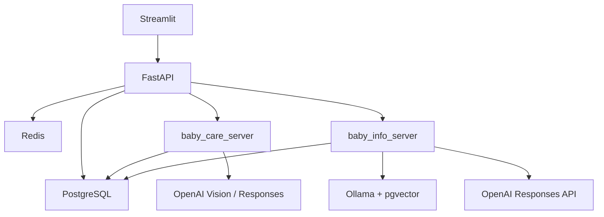
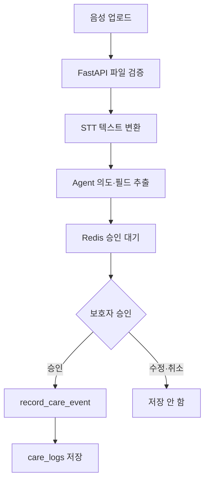
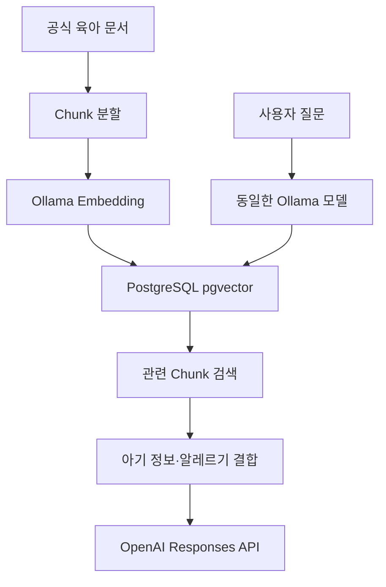

# 0~36개월 영유아 AI 육아 도우미 Agent 기획안

<aside>
👶

**0~36개월 영유아 보호자의 기록·분석·정보 탐색을 통합 지원하는 테스트용 AI 육아 도우미**

</aside>

## 1. 프로젝트 개요

영유아 보호자가 수유·수면·배변·성장 기록을 관리하고, 아기의 월령과 저장된 정보에 맞는 육아 지식을 확인할 수 있는 학원 팀 프로젝트용 프로토타입입니다.

- 개발 언어: Python
- 프론트엔드: Streamlit
- 백엔드: FastAPI
- 영구 저장: PostgreSQL
- 임시 상태: Redis
- 임베딩: Ollama Embedding
- 벡터 저장·검색: PostgreSQL pgvector
- 최종 답변: OpenAI Responses API
- 로그인·예방접종: 가짜 데이터
- 음성 입력: 보호자 음성을 텍스트로 변환하는 STT 포함

## 2. 해결하려는 문제

- 여러 곳에 흩어진 육아 기록과 정보
- 반복되는 수유·수면·배변 기록 부담
- 아기 월령과 알레르기를 반영한 정보 탐색의 어려움
- 예방접종 일정과 의료기관 정보 확인의 번거로움

## 3. 주요 사용자

- 0~36개월 영유아 보호자
- 육아 기록을 간편하게 관리하고 싶은 사용자
- 월령별 공식 육아정보가 필요한 초보 보호자
- 지역명으로 소아과·응급실을 찾고 싶은 사용자

## 4. 핵심 원칙

- 아기 정보는 AI의 대화 기억이 아니라 PostgreSQL에 영구 저장합니다.
- 로그인한 테스트 사용자의 아기 정보만 조회합니다.
- 알레르기는 중요한 건강정보로 저장하고 관련 답변 전에 우선 확인합니다.
- 의료 진단, 처방, 정상·비정상 판정을 하지 않습니다.
- 데이터가 변경되는 기록·수정·삭제 작업은 사용자 승인 후 실행합니다.
- 조회·검색 Tool은 별도 승인 없이 실행할 수 있습니다.
- 음성이나 사진을 분석했더라도 사용자 승인 없이 육아 기록으로 저장하지 않습니다.

## 5. 구현 범위

### 포함

- 가짜 사용자 로그인과 세션
- 아기 정보 등록·조회·수정
- 수유·수면·배변·성장 기록
- 기록 조회·수정·삭제와 기초 패턴 요약
- 수유 화면 알림과 알림 간격 설정
- 보호자 음성 STT와 기록 승인
- 기저귀 사진 관찰
- RAG 기반 육아 지식 검색
- 지역명 기반 소아과·응급실 검색
- 가짜 예방접종 내역과 다음 일정
- 성장 그래프와 참고 정보

### 제외

- 실제 회원가입·비밀번호·JWT 인증
- 실제 휴대전화 푸시 알림
- 실제 예방접종 API·본인인증·CODEF
- 관리자 페이지
- 과거 채팅 검색
- 영상 분석과 아기 울음소리 분석
- 의료 진단과 처방

## 6. 최종 화면

1. 시작·테스트 로그인
2. 홈
3. AI 육아 도우미
4. 육아 관리
5. 내 정보

### 육아 관리 탭

- 생활 기록: 수유·수면·배변 기록 조회·수정·삭제, 최근 패턴
- 성장: 키·몸무게·머리둘레 그래프와 참고값
- 예방접종: 가짜 완료 내역과 다음 일정

## 7. 전체 시스템 구성

!image.png



## 8. MCP 서버

### baby_care_server

육아 기록 저장·조회·패턴 계산과 기저귀 사진 분석을 담당합니다.

- `record_care_event`: 확정된 육아 기록 저장
- `get_care_records`: 오늘·기간·패턴·마지막 수유 조회
- `analyze_infant_stool`: 기저귀 사진 관찰 Workflow

### baby_info_server

육아 지식 RAG와 지역명 기반 의료기관 검색을 담당합니다.

- `search_pediatric_hospitals`
- `search_emergency_hospitals`
- `search_feeding_guide`
- `search_sleep_guide`
- `search_weaning_guide`
- `search_development_guide`
- `search_safety_guide`

예방접종은 FastAPI가 가짜 JSON을 조회하므로 MCP Tool을 만들지 않습니다.

## 9. 데이터와 접근 담당

| 데이터 | 저장 위치 | 접근 담당 |
| --- | --- | --- |
| `babies` | PostgreSQL | FastAPI |
| `care_logs` 저장·조회 | PostgreSQL | `baby_care_server` |
| `care_logs` 수정·삭제 | PostgreSQL | FastAPI |
| `reminder_settings` | PostgreSQL | FastAPI |
| `documents` | PostgreSQL | `baby_info_server` |
| `document_chunks` | PostgreSQL·pgvector | `baby_info_server` |

`care_logs`는 하나의 통합 테이블이며 기능별 접근 담당만 나눕니다.

## 10. 음성 육아 기록



지원 형식은 MP3·WAV·M4A·WebM이며 최대 20MB로 제한합니다. 음성 원본은 처리 후 삭제하고 DB나 로그에 저장하지 않습니다.

## 11. 수유 알림

마지막으로 확정된 수유 시각과 `reminder_settings`의 간격으로 다음 알림 시각을 계산합니다. 실제 푸시는 보내지 않고 로그인 후 홈과 AI 육아 도우미 화면에 같은 알림 카드를 표시합니다.

- **수유했어요**: 수유량·방식·시각 확인 → 사용자 승인 → 기록 저장 → 실제 수유 시각부터 다시 계산
- **10분 후**: 현재 시각부터 10분 후 다시 표시
- **건너뛰기**: 육아 기록을 저장하지 않고 현재 시각부터 설정 간격을 다시 계산

> 이번 알림을 건너뛰었어요. 3시간 후 다시 알려드릴게요.
> 

건너뛰기는 마지막 수유 기록을 변경하지 않습니다.

## 12. RAG 처리



문서와 질문은 동일한 `OLLAMA_EMBEDDING_MODEL`을 사용하고, 모델 출력 차원과 DB의 `vector(차원)`을 일치시킵니다. 모델을 바꾸면 기존 문서를 다시 임베딩합니다.

## 13. 기저귀 사진 분석

사진 형식·크기와 품질을 검사한 뒤 관찰 가능한 색상·형태·묽기를 정리합니다. 규칙 기반 위험 신호와 `stool` RAG 근거를 함께 확인합니다. 사진만으로 질환을 진단하지 않으며 원본은 기본적으로 영구 저장하지 않습니다. 관찰 결과를 기록하려면 보호자의 별도 승인이 필요합니다.

## 14. 의료기관 검색

현재 위치·위도·경도는 사용하지 않습니다. 사용자가 입력한 지역명으로 소아과와 응급실을 검색합니다. 결과에는 병원명·주소·전화번호와 확인 시점을 표시하고, 실제 운영시간과 진료 가능 여부는 방문 전에 전화로 확인하도록 안내합니다.

## 15. Tool 승인 정책

승인이 필요한 작업:

- `record_care_event`
- 아기 정보 수정
- 육아 기록 수정
- 육아 기록 삭제

승인 대기 데이터는 Redis의 `tool_approval:{tool_call_id}`에 짧은 TTL로 저장합니다. 중복 저장 방지를 위해 `idempotency_key`를 사용합니다.

## 16. 안전 기준

- 의료진의 판단을 대신하지 않습니다.
- RAG 근거가 부족하면 추측하지 않습니다.
- 성장과 배변을 정상·비정상으로 단정하지 않습니다.
- 투약 용량이나 처방을 결정하지 않습니다.
- 위험 신호가 있으면 의료기관 또는 119 안내를 우선합니다.
- API Key, 접속정보, 원본 음성·사진을 로그에 남기지 않습니다.

## 17. 완료 기준

- MCP 서버 이름은 `baby_care_server`, `baby_info_server`로 통일
- MCP Tool은 각각 3개와 7개
- PostgreSQL 테이블은 `babies`, `care_logs`, `reminder_settings`, `documents`, `document_chunks`
- Supabase를 사용하지 않음
- 육아 기록은 `care_logs` 하나로 통합
- 기록·수정·삭제는 사용자 승인 후 실행
- RAG는 Ollama Embedding과 PostgreSQL pgvector 사용
- 병원은 지역명으로 검색
- 가짜 로그인·가짜 예방접종·화면 알림으로 시연 가능

## 18. 아기 정보 상세

### 필수·선택 입력

| 항목 | 필수 | 활용 | 검증 |
| --- | --- | --- | --- |
| 이름·애칭 | 필수 | 아기 구분·화면 표시 | 1~30자 |
| 생년월일 | 필수 | 생후 일수·개월 계산 | 미래 날짜 금지 |
| 성별 | 필수 | 성장 참고값 비교 | 허용값만 사용 |
| 몸무게 | 선택 | 성장 추세·맞춤 답변 | 0보다 큰 값 |
| 키 | 선택 | 성장 추세 | 0보다 큰 값 |
| 수유 방식 | 필수 | 수유 답변 맞춤화 | 모유·분유·혼합 |
| 알레르기 | 선택 | 이유식·건강 답변 우선 확인 | 보호자 직접 입력 |

```json
{
  "baby_name": "서아",
  "birth_date": "2026-08-03",
  "gender": "female",
  "current_weight_kg": 4.2,
  "current_height_cm": 54.0,
  "feeding_type": "formula",
  "allergies": ["계란"]
}
```

아기 정보는 대화 내역에서 추측하거나 기억하지 않고 매 요청 시 로그인한 테스트 사용자의 DB 데이터에서 조회합니다.

## 19. 육아 기록 상세

`care_logs`의 `log_type`은 다음 네 종류로 제한합니다.

### 수유

- 수유 방식: `breast`, `formula`, `mixed`
- 수유량: 입력하는 경우 0보다 큰 ml
- 기록 시각: 직접 입력하지 않으면 현재 한국 시간

### 수면

- `start`, `end` 동작으로 기록
- 이미 수면 중일 때 중복 시작 금지
- 시작 기록이 없을 때 종료 금지
- 패턴 조회 시 시작·종료를 연결해 수면 시간을 계산

### 기저귀

- 소변·대변 중 하나 이상 선택
- 색상·형태·메모는 선택
- 사진 분석값은 승인 후 색상·형태처럼 구조화된 결과만 저장 가능

### 성장

- 몸무게·키·머리둘레 중 하나 이상 입력
- 모든 수치는 0보다 커야 함
- 진단이나 정상·비정상 판단 없이 변화와 참고값만 제공

## 20. 기록 조회·패턴

조회 범위:

- 오늘
- 날짜 범위
- 최근 7일 패턴
- 마지막 확정 수유 기록

패턴 결과:

- 수유 횟수·평균량·평균 간격
- 총수면시간·평균 수면시간
- 소변·대변 횟수
- 분석 가능한 기록량 여부 `sufficient_data`

기록이 부족한 경우 숫자를 만들어내지 않고 다음처럼 표시합니다.

> 아직 생활 패턴을 분석할 만큼 기록이 충분하지 않아요. 기록이 더 쌓이면 평균과 변화를 알려드릴게요.
> 

## 21. 사용자 시나리오

### 첫 이용

```
테스트 사용자 선택
→ 연결된 아기 확인
→ 아기가 없으면 기본정보 등록
→ 생후 일수 계산
→ 홈에서 월령별 가이드·알림·최근 기록 확인
```

### 텍스트 빠른 기록

```
수유 버튼
→ 방식·수유량·시각 입력
→ 확인 카드
→ 기록 완료
→ baby_care_server 저장
→ 홈·육아 관리 갱신
```

### 음성 기록

```
음성 파일 업로드
→ STT 결과 확인
→ Agent가 기록 종류·값 추출
→ 사용자가 수정 또는 승인
→ 승인한 경우에만 저장
```

### 육아 질문

```
질문 입력
→ 아기 월령·수유 방식·알레르기 조회
→ baby_info_server RAG 검색
→ 근거와 함께 답변
```

### 기저귀 사진

```
사진 업로드
→ 품질 검사
→ 관찰 결과
→ 위험 신호 안내
→ 사용자가 저장 여부 결정
```

## 22. 예외 상황

- 선택한 테스트 사용자의 아기가 없으면 등록 화면으로 이동
- STT 인식 실패 시 직접 텍스트 입력 제공
- RAG 근거가 없으면 일반 지식으로 단정하지 않음
- 의료기관 결과가 없으면 빈 결과 안내
- Redis 장애 시 영구 데이터 조회는 PostgreSQL에서 계속
- MCP 연결 실패 시 재시도 가능 안내
- 승인 요청 만료 시 DB 변경 없이 다시 확인
- 중복 클릭 시 같은 기록이 두 번 저장되지 않도록 처리

## 23. 시연 데이터

가짜 사용자는 최소 2명으로 준비하고 각 사용자의 아기·기록·알레르기·예방접종 데이터를 서로 다르게 구성합니다. 다른 사용자의 `baby_id`를 요청해도 조회되지 않는지 시연합니다.

추천 시연:

- 분유 수유 중인 생후 1개월 아기
- 이유식 중이며 알레르기가 등록된 생후 8개월 아기
- 최근 7일 기록이 충분한 사용자
- 기록이 부족해 패턴을 만들 수 없는 사용자

## 추천 담당 구분

| 담당자 | 담당 폴더 | 주요 작업 |
| --- | --- | --- |
| 1번 | `frontend/` | Streamlit 화면과 FastAPI 연결 |
| 2번 | `backend/` | FastAPI·Agent·승인·Redis |
| 3번 | `mcp_servers/baby_care_server/` | 육아 기록·기저귀 분석 |
| 4번 | `mcp_servers/baby_info_server/` | RAG·Ollama·병원 검색 |

## 최종 디렉토리 구조

```
baby-ai-agent/
│
├─ frontend/
│  ├─ app.py
│  ├─ pages/
│  │  ├─ login_page.py
│  │  ├─ home_page.py
│  │  ├─ care_page.py
│  │  ├─ vaccination_page.py
│  │  ├─ chat_page.py
│  │  └─ profile_page.py
│  ├─ common.py
│  └─ api.py
│
├─ backend/
│  ├─ app/
│  │  ├─ main.py
│  │  │
│  │  ├─ core/
│  │  │  ├─ config.py
│  │  │  ├─ constants.py
│  │  │  ├─ api_response.py
│  │  │  ├─ exceptions.py
│  │  │  ├─ logging.py
│  │  │  └─ record_policy.py
│  │  │
│  │  ├─ routers/
│  │  │  ├─ auth_router.py
│  │  │  ├─ baby_router.py
│  │  │  ├─ care_router.py
│  │  │  ├─ info_router.py
│  │  │  ├─ chat_router.py
│  │  │  ├─ media_router.py
│  │  │  └─ memory_router.py
│  │  │
│  │  ├─ schemas/
│  │  │  ├─ common.py
│  │  │  ├─ auth.py
│  │  │  ├─ baby.py
│  │  │  ├─ care.py
│  │  │  ├─ info.py
│  │  │  ├─ chat.py
│  │  │  ├─ media.py
│  │  │  └─ memory.py
│  │  │
│  │  ├─ services/
│  │  │  ├─ auth_service.py
│  │  │  ├─ baby_service.py
│  │  │  │
│  │  │  ├─ care/
│  │  │  │  ├─ care_log_service.py
│  │  │  │  ├─ reminder_service.py
│  │  │  │  └─ growth_service.py
│  │  │  │
│  │  │  ├─ info/
│  │  │  │  ├─ vaccination_service.py
│  │  │  │  └─ hospital_service.py
│  │  │  │
│  │  │  ├─ agent/
│  │  │  │  ├─ agent_service.py
│  │  │  │  ├─ chat_stream_service.py
│  │  │  │  ├─ tool_call_service.py
│  │  │  │  ├─ memory_service.py
│  │  │  │  ├─ memory_selector.py
│  │  │  │  ├─ memory_safety_service.py
│  │  │  │  └─ memory_trace_service.py
│  │  │  │
│  │  │  └─ media/
│  │  │     ├─ image_service.py
│  │  │     └─ speech_service.py
│  │  │
│  │  ├─ repositories/
│  │  │  ├─ baby_repository.py
│  │  │  ├─ care_log_repository.py
│  │  │  ├─ vaccination_repository.py
│  │  │  ├─ reminder_repository.py
│  │  │  └─ memory_repository.py
│  │  │
│  │  ├─ models/
│  │  │  ├─ baby.py
│  │  │  ├─ care_log.py
│  │  │  ├─ vaccination.py
│  │  │  ├─ reminder.py
│  │  │  ├─ tool_execution.py
│  │  │  └─ user_memory.py
│  │  │
│  │  ├─ prompts/
│  │  │  ├─ memory_extraction_prompt.txt
│  │  │  └─ memory_selection_prompt.txt
│  │  │
│  │  └─ mcp_clients/
│  │     ├─ baby_care_client.py
│  │     └─ baby_info_client.py
│  │
│  ├─ data/
│     ├─ test_users.json
│     ├─ vaccinations.json
│     └─ growth_reference.json
│ 
│
├─ mcp_servers/
│  │
│  ├─ baby_care_server/
│  │  ├─ server.py
│  │  ├─ config.py
│  │  ├─ constants.py
│  │  │
│  │  ├─ tools/
│  │  │  ├─ record_care_event.py
│  │  │  ├─ get_care_records.py
│  │  │  └─ analyze_infant_stool.py
│  │  │
│  │  ├─ schemas/
│  │  │  ├─ care.py
│  │  │  └─ stool.py
│  │  │
│  │  ├─ services/
│  │  │  ├─ care_service.py
│  │  │  ├─ pattern_service.py
│  │  │  └─ stool_analysis_service.py
│  │  │
│  │  ├─ repositories/
│  │  │  ├─ care_log_repository.py
│  │  │  └─ rag_repository.py
│  │  │
│  │  ├─ prompts/
│  │  │  ├─ stool_vision_prompt.txt
│  │  │  └─ stool_answer_prompt.txt
│  │  │
│  │  ├─ workflows/
│  │  │  └─ stool_analysis_workflow.py
│  │  │
│  │  ├─ rules/
│  │  │  └─ infant_stool_triage.yaml
│  │  │
│  │  └─ tests/
│  │     ├─ test_record_care_event.py
│  │     ├─ test_get_care_records.py
│  │     └─ test_stool_analysis.py
│  │
│  └─ baby_info_server/
│     ├─ server.py
│     ├─ config.py
│     ├─ constants.py
│     │
│     ├─ tools/
│     │  ├─ search_pediatric_hospitals.py
│     │  ├─ search_emergency_hospitals.py
│     │  ├─ search_feeding_guide.py
│     │  ├─ search_sleep_guide.py
│     │  ├─ search_weaning_guide.py
│     │  ├─ search_development_guide.py
│     │  └─ search_safety_guide.py
│     │
│     ├─ schemas/
│     │  ├─ hospital.py
│     │  └─ knowledge.py
│     │
│     ├─ services/
│     │  ├─ hospital_service.py
│     │  ├─ emergency_service.py
│     │  ├─ rag_service.py
│     │  ├─ embedding_service.py
│     │  └─ answer_service.py
│     │
│     ├─ repositories/
│     │  └─ rag_repository.py
│     │
│     ├─ prompts/
│     │  └─ rag_answer_prompt.txt
│     │
│     ├─ ingestion/
│     │  ├─ document_loader.py
│     │  ├─ chunker.py
│     │  └─ indexer.py
│     │
│     └─ tests/
│        ├─ test_hospital_tools.py
│        ├─ test_rag_tools.py
│        └─ test_mcp_tools.py
│
├─ documents/
│
├─ .gitignore
├─ .env.example
├─ docker-compose.yml
├─ requirements.txt
└─ README.md
```

## 환경변수 파일 관리

실제 `.env`는 각 팀원의 컴퓨터에만 두고 GitHub에는 올리지 않습니다.

```
.env           # GitHub에 올리지 않음
.env.example   # GitHub에 올림
```

`.gitignore`:

```
.env
__pycache__/
*.pyc
.venv/
uploads/
```

`.env.example`은 공통으로 하나만 사용해도 됩니다.

```
APP_ENV=development
APP_TIMEZONE=Asia/Seoul

BACKEND_API_URL=http://localhost:8000

POSTGRES_DSN=
REDIS_URL=

OPENAI_API_KEY=
OPENAI_MODEL=
STT_MODEL=

BABY_CARE_MCP_URL=http://localhost:8101
BABY_INFO_MCP_URL=http://localhost:8102

OLLAMA_BASE_URL=http://localhost:11434
OLLAMA_EMBEDDING_MODEL=
OLLAMA_EMBEDDING_DIMENSION=

PEDIATRIC_API_KEY=
EMERGENCY_API_KEY=
```


